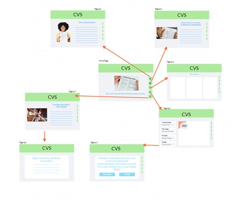
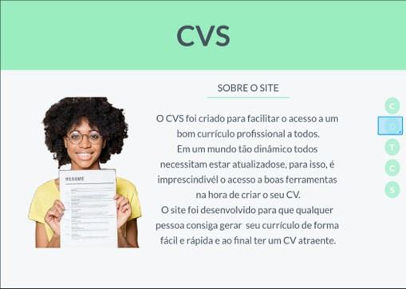
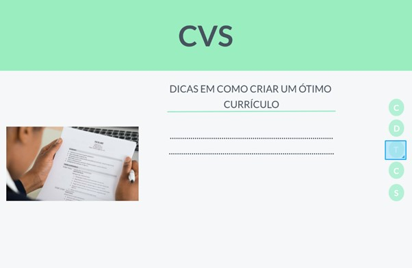
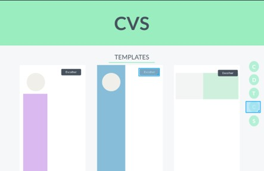
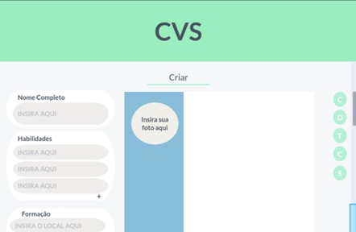
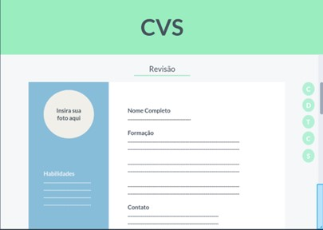
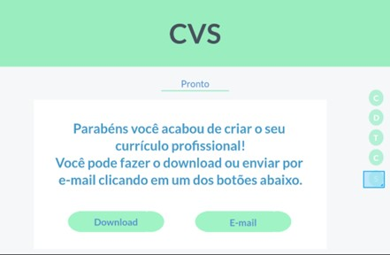
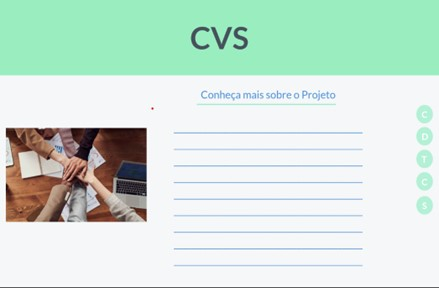

# Projeto de Interface

Pré-requisitos: <a href="2-Especificação do Projeto.md"> Documentação de Especificação</a>

Visão geral da interação do usuário pelas telas do sistema e protótipo interativo das telas com as funcionalidades que fazem parte do sistema (wireframes).

 Apresente as principais interfaces da plataforma. Discuta como ela foi elaborada de forma a atender os requisitos funcionais, não funcionais e histórias de usuário abordados nas <a href="2-Especificação do Projeto.md"> Documentação de Especificação</a>.

## User Flow

Figura 2 - UserFlow

Fluxo de usuário (User Flow) é uma técnica que permite ao desenvolvedor mapear todo fluxo de telas do site ou app. Essa técnica funciona para alinhar os caminhos e as possíveis ações que o usuário pode fazer junto com os membros de sua equipe.

## Wireframes

Figura 3 – Estrutura padrão do site 

Figura 4 - Tela informativa sobre o site  

Figura 5 - Tela de dicas para criação de currículo   

Figura 6 - Templates   

Figura 7 – Tela de criação de currículos 

Figura 8 - Tela de revisão de currículo  </center<

 

 
Figura 9 - Tela de pronto  

 

 
Figura 10 - Tela de informações do projeto  

