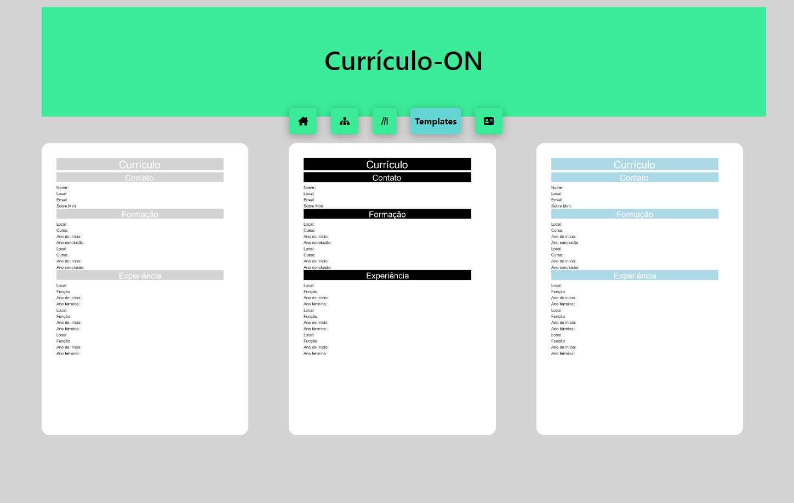
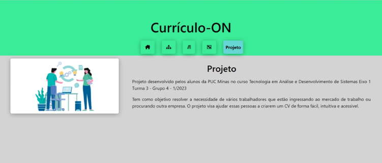

6. Template do Site
O template criado está disponível no site http://github.com/…  e é composto pelos seguintes layouts: 
●	Tela da Home-Page
●	Tela do Site
●	Tela de Dicas 
●	Templates
●	Tela de inserção de dados

A responsividade segue o padrão do Bootstrap.   (Rever Linha)

Home-Pag

 

Tela de informe do site

Neste template, são apresentados os principais motivos que levaram à criação desta aplicação de currículos online. Entre eles, destacam-se a facilidade de uso, a personalização dos templates, a eficiência na criação de um currículo atrativo e a disponibilidade de diversas ferramentas e recursos para auxiliar na busca por uma vaga de emprego.

 

Dicas

Nesta etapa, são apresentados os erros mais frequentes na elaboração de um currículo, acompanhados de dicas para evitá-los e do melhor caminho a ser seguido para a sua criação.
 

Templates

Neste espaço, o usuário pode explorar diferentes estilos de currículo e escolher aquele que melhor se adequa às suas experiências, habilidades e objetivos profissionais.

 

Tela de inserção de dados

Neste espaço, é importante incluir todas as informações relevantes para a elaboração de um currículo completo e efetivo, destacando as habilidades, experiências e qualificações do candidato de forma clara e objetiva.
 

Projeto

Desenvolvimento turma 3 - Grupo 4 – Projeto CVO, PUC MINAS 2023. 
  
